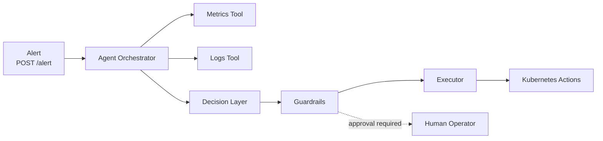

# Agentic SRE Platform


Agentic incident triage and remediation prototype for cloud-native operations. The service accepts alerts, gathers context from logs and metrics tools, asks an LLM-style decision layer for a proposed action, and routes the action through guardrails before execution.

## What This Demonstrates

- Agentic SRE workflow design
- Alert ingestion with FastAPI
- Tool-based context gathering
- Kubernetes-aware remediation hooks
- Approval guardrails for high-risk actions
- Clean separation between reasoning, tools, guardrails, and execution

## Architecture



Detailed architecture: [architecture.md](architecture.md)

## Request Flow

1. An alert is posted to `/alert`.
2. The agent gathers service metrics and pod logs.
3. The decision layer proposes a remediation.
4. Guardrails decide whether approval is required.
5. Approved actions are executed through the executor.
6. The API returns the decision and execution status.

## Run Locally

Create and activate a virtual environment:

```bash
python3 -m venv .venv
source .venv/bin/activate
```

Install dependencies:

```bash
pip install -r requirements.txt
```

Start the API:

```bash
uvicorn app.main:app --reload
```

Send a sample alert:

```bash
curl -X POST http://127.0.0.1:8000/alert \
  -H "Content-Type: application/json" \
  -d '{"service":"checkout","severity":"critical","summary":"error rate above threshold"}'
```

## Repository Layout

```text
.
├── app/
│   ├── agent.py          # orchestrates alert triage
│   ├── executor.py       # executes approved remediation
│   ├── guardrails.py     # approval and safety controls
│   ├── llm.py            # decision layer
│   ├── main.py           # FastAPI entrypoint
│   └── tools/            # logs, metrics, Kubernetes tools
├── k8s/                  # demo Kubernetes manifests
├── architecture.md       # architecture deep dive
└── requirements.txt
```

## Safety Model

| Action Type | Handling |
| --- | --- |
| read-only context gathering | allowed automatically |
| low-risk remediation | can execute automatically |
| rollback or disruptive action | requires operator approval |
| unknown action | should be denied or routed for review |

## Portfolio Notes

This is intentionally a prototype, not a production incident platform. It demonstrates the architecture and safety boundaries that matter in real SRE automation:

- tool use instead of opaque free-form execution
- human approval for risky changes
- auditable decisions
- Kubernetes-native operating context
- clear extension points for real observability systems
