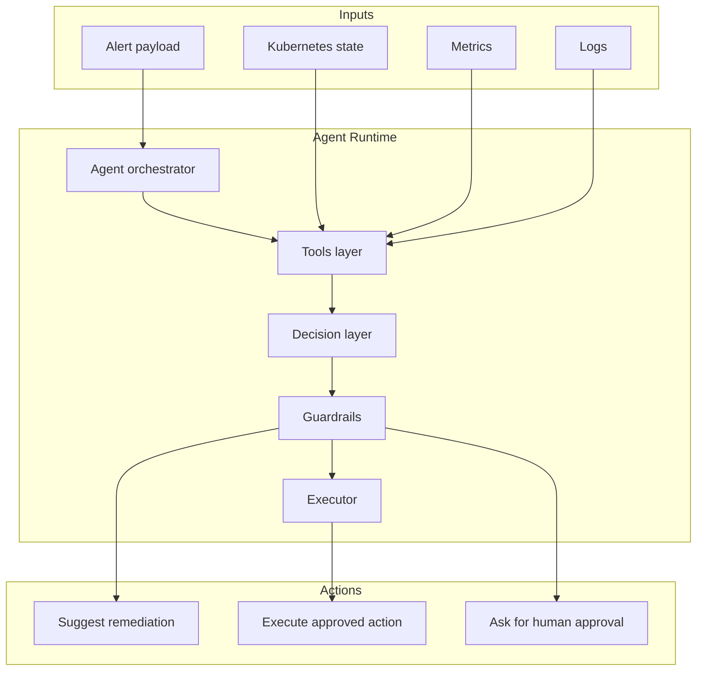
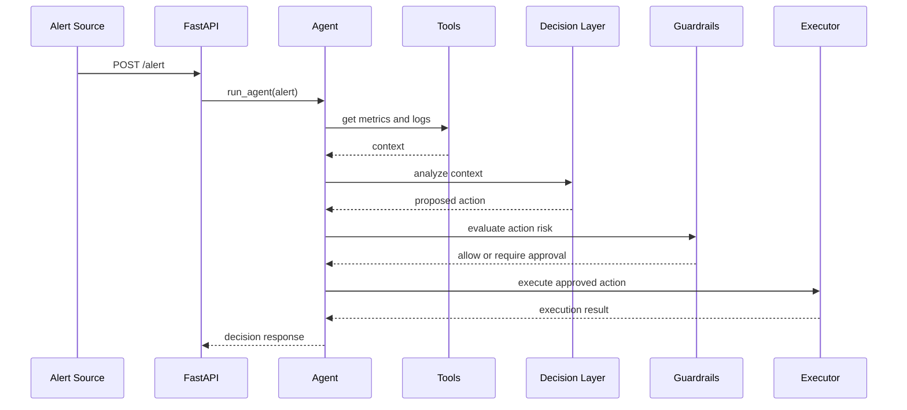

# Architecture

The platform is built around a small agent loop: ingest alert, gather context, reason over the situation, apply guardrails, and execute only approved actions.

## Components

| Component | Responsibility |
| --- | --- |
| FastAPI entrypoint | Receives alert payloads through `/alert` |
| Agent orchestrator | Coordinates context gathering and decision flow |
| Logs tool | Fetches workload logs |
| Metrics tool | Fetches service health signals |
| Kubernetes tool | Provides cluster action hooks |
| Decision layer | Produces a structured remediation recommendation |
| Guardrails | Requires approval for risky actions |
| Executor | Performs approved remediation |

## Sequence

## Design Principles

- Safe by default
- Tool-based execution instead of arbitrary shell access
- Human approval for destructive operations
- Clear separation between reasoning and execution
- Extensible integrations for real observability systems
